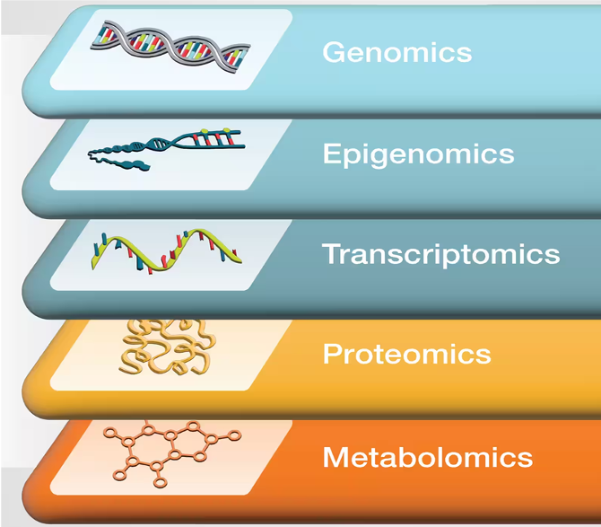

# Bioinformatics In Psychiatry and Neuroscience

BIPN is dedicate to conceptualize user needs in bioinformatics, to process data and to interpret the results from High-throughput projects in the specific fields of neuroscience and psychiatry. The platform is able to develop omics’ molecular analyses (genomics with Genome-wide Association study or Polygenic risk score, methylomics, trancriptomics, proteomics). Another mission of the platform is to maintain and transmit the adequate tools, coding and computer resources to manage data flows, storage and accessibility. 

BIPN has expertise for Collection, Processing, Analysis and interpretation In different domains
| **Category**               | **Details**                                                                          |
|----------------------------|--------------------------------------------------------------------------------------|
| **Data Management**        | Data Warehousing, Data Architecture, Data Bases, Data Transformation, Languages      |
| **Languages**              | Linux, Python, SQL, R                                                               |
| **Computer Tools**         | [Plink](https://github.com/chrchang/plink-ng), [PRSice2](https://github.com/choishingwan/PRSice), [Minfi](https://github.com/hansenlab/minfi), [Kallisto](https://github.com/pachterlab/kallisto), [Bismark](https://github.com/FelixKrueger/Bismark), [ENSEMBL-VEP](https://github.com/Ensembl/ensembl-vep) |
| **Transmission**           | Generate scripts, Create tutorials, Design analysis, Teaching computer tools        |
| **Collaborations with IPNP Teams** | [Team Krebs](https://ipnp.paris5.inserm.fr/recherche/equipes-et-projets/7-equipe-krebs), [Team Gorwood/Ramoz](https://ipnp.paris5.inserm.fr/recherche/equipes-et-projets/11-equipe-gorwood), [Team Oppenheim](https://ipnp.paris5.inserm.fr/recherche/equipes-et-projets/18-equipe-oppenheim), GHU Paris (Anatomopathology) |
| **External Collaborations**| [PEPR-PROPSY](https://pepr-propsy.fr), [CNRGH](https://jacob.cea.fr/drf/ifrancoisjacob/english/Pages/Departments/CNRGH.aspx), [Institut Imagine](https://www.institutimagine.org/en), Private companies (Diagenode, Integragen)     |
| **IPNP Facilities**        | 1 NAS [DS1819+](https://global.download.synology.com/download/Document/Hardware/DataSheet/DiskStation/19-year/DS1819+/fre/Synology_DS1819_Plus_Data_Sheet_fre.pdf) (48 To of storage), 1 Working station (1 To of RAM & 88 CPUs), research engineer : [Benjamin Demaille|()https://www.linkedin.com/in/benjamin-demaille/

<!--

**Here are some ideas to get you started:**

🙋‍♀️ A short introduction - what is your organization all about?
🌈 Contribution guidelines - how can the community get involved?
👩‍💻 Useful resources - where can the community find your docs? Is there anything else the community should know?
🍿 Fun facts - what does your team eat for breakfast?
🧙 Remember, you can do mighty things with the power of [Markdown](https://docs.github.com/github/writing-on-github/getting-started-with-writing-and-formatting-on-github/basic-writing-and-formatting-syntax)
-->
